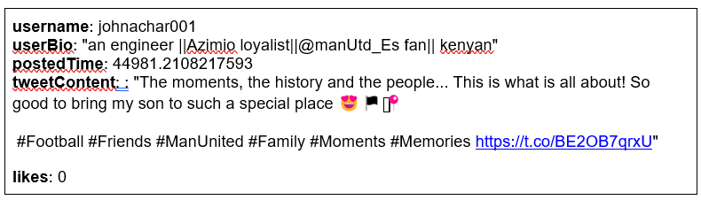
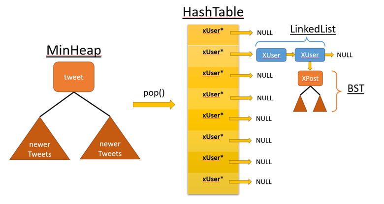

[](https://classroom.github.com/a/Ee1XOIkT)
# CSCI 2270 – Data Structures - Final Project

 **ANY USE OF TOOLS SUCH AS CHATGPT WILL BE CONSTRUED AS PLAGIARISM AND RESULT IN A 0. YOU ARE REQUIRED TO CONDUCT INTERVIEW GRADING AND BE EXPECTED TO ANSWER DETAILED QUESTIONS ABOUT YOUR CODE.** 
  
## Objectives

1. Hashing
2. Chaining with linked lists
3. Interfacing with minHeap
4. Integration and nesting of multiple data structures including BST

## Instructions to run 

Please read all the directions ​*before* writing code, as this write-up contains specific requirements for how the code should be written.

To receive credit for your code, you will need to pass the necessary test cases. Use the following steps to test your code as you work on the assignment:

 1. Open up your Linux terminal, navigate to the main directory 
 2. Run the `make` command.
 3. If there are no compilation errors, an executable will be generated within the directory: `run_app`.
 5. If you would like to run your program, execute `run_app` from the terminal by typing `./run_app <twitter data csv filename>`.
 6. To test, select a menu option to validate behavior 

## Background 

You are a programmer working for the newly aquired and rebranded "X", formerly known as "Twitter". Your task is to migrate the Twitter database into a new design that will be used by X. The new 'X' methodology will replace the old strategy of storing tweets in a single data structure for a more efficient model requiring two structures, one for users (XUser) and one for posts (XPost). These structs will be stored in a hash table employing linked lists for chaining collisions, and a BST for storing user's tweets.

This project will have you creating and maintaining a new database of Twitter data, where you will need to interact with a struct representing tweets and reorganize the data into XUser and XPost structs containing the following:
1.	username: string identifying tweet author
2.	userBio: string containing user’s biography statement
3.	postedTime: time of tweet, represented by float variable encapsulating month/day/year and time information. You do not need to be able to extract the full month/day/year information for this project, being able to compare these floats will be sufficient
4.	tweetContent: body of tweet, string format
5.	likes: integer representing number of likes tweet received


Here is one example of a tweet


Which will be stored using the following structure (can be found at minHeap.hpp):
```
struct tweet {
	string username;
	string userBio;
	float postedTime; // key
	string tweetContent;
	int likes;
};
```

 ## Overview
 
Your first task will be to store the tweets in a hash table with chaining. Each node in the chain will represent a single user, along with their post count and biography statements. Username will serve as the key for the hashing function, which means two users may be mapped to the same bucket. Due to this, new users will be added to the head of the linked list at that bucket. 

Under each user in the table will be stored a collection of their posts. Each post will serve as a node of a BST. PostedTime will serve as the key for inserting into the BST, and the BST does not need to be balanced. Elon himself has instructed that we can balance the trees later…

See the diagram below for an overview of the desired structures:


The tweet data you will be handling has already been cleaned and parsed into a minHeap data structure (as seen above). The minHeap is sorted by postedTime just as your BST will be. In order to intake the data correctly, we want to pop from the minHeap so we add all of the data back in historic order (oldest first). Each pop from the minHeap will produce a tweet struct that you will parse into corresponding XUser and XPost structs. During hashing, the hash function will take the username and return the bucket index in the hash table. Indexing the table at this bucket will correspond to a head pointer for the appropriate chain. Each username will have a distinct node in the chain. Therefore, find the node with the current username to perform the desired actions. 

Note that as mentioned and depicted above, each node will have a BST associated with it. The BST pointer will simply be stored inside of the user node. This is an object pointer for an instance of a BST class, just like any other you’d normally declare, but here stored in the XUser struct. The XUser and XPost structs can be seen below, representing the hash table and BST nodes respectively.

```
struct XUser {
	string username; 
	string userBio;
	int postCount;
	XUser* next;
	BST* bst;
};
```

```
struct XPost {
	int postedTime;
	string xContents;
	int likes;
	XPost* left;
	XPost* right;
};
```

 ## Hashing

For this project you are required to implement hashing with chaining for collision resolution. hash.cpp should implement all the functions required for hashing. Please refer to the hash.hpp for class definition and function declaration. Note each node will contain a pointer to a BST to store the individual post/tweet information. XUser structure was discussed above and can be found in hash.hpp.

HashTable will have a dynamically allocated array pointer given as XUser* *table. Note, the array will store the heads of the linked list chains. Therefore each element of the array is of type XUser* and the other ‘*’ represents the fact that an array is created with a pointer (recall how with a pointer we created dynamic memory allocation for arrays).

The class of HashTable will also store a variable for numCollision to keep track of the number of collisions. Remember if two keys x and y are such that x!=y but hash(x)==hash(y) then it is a collision by definition. So, for example if you entered the username ‘iron_man’ and then you tried to insert a second ‘iron_man’ there is no collision. If you then inserted the user ‘bat_man’ and hash(iron_man) == hash(bat_man), now you have a collision. So the variable  numCollision should be adjusted accordingly. Beyond this any other insertion of ‘iron_man’ or  ‘bat_man’ will not change numCollision.

**NOTE:** `main.cpp` file has been provided for you. Do NOT make any changes to the `main.cpp` file). For the described setting, you will have to implement the following #TODO functions in `hash.cpp` & `bst.cpp`. 

### unsigned int hashFunction(string key);

This function calculates the hash value for a given string. To calculate the hash value of a given string, sum up the ascii values of all the characters from the string. Then take the% operator with respect to tableSize. 

Return the hash table index for the key as an unsigned int (why unsigned?)
    
### XUser* insertUser(string username, string userBio);

This function takes in new user data via `username` and `userBio` strings and do the following:
1. Check if the username has already been added, return NULL if so 
Otherwise
2. Call your `hashFunction()` with the `username` as key. 
3. Use the helper function `createUser()` if a new user is to be added, this should return an instance of a new XUser struct.
4. Handle collisions by inserting new XUser structs at head of linked list chain at desired index (Reminder: table[index] is the bucket containing the head pointer, follow your types!)
5. Keep track of collisions
6. Return pointer to new user node on success
    
### XUser* searchUser(string username);

This function takes in the `username` to be searched for in the hash table. This means you must lean on your `hashFunction()` to find the appropriate bucket and traverse the links there. 

Return NULL if no user found.
    
### void printUsers();

This function takes no inputs and does not return any information. For every bucket in the table, print the contents of the chain in the following: 

```
1|ohio_cards-->StaticP7-->NULL
0|NULL
2|AGroupNews1-->DhakaTribune-->crazymukola-->joeybakes_-->NULL
```
    
### void printAllPostByUser(string username);

This function takes the `username` to be searched for in the hash table. If the user cannot be found, print the message `User does not exit, try again..."` and return with no other behavior. Otherwise, display the user's posts in the follwing format:

```
himalaya_times:
| userBio: Official Twitter handle of Himalaya Times National Daily, Nepal's leading newspaper and https://t.co/JqQXlkowOP
 For english News : https://t.co/JHcxSxp99S
| postCount: 1
| Posts:
1559027840:
---> डि मारियाको ह्याट्रिकमा युभेन्ट्सको सहज जित
 #dmariya #uvents #khel #sports #football #HimalayaTimes #Hita #Himalaya_Times #nepalihimalayatimes #News #Dailynewspaper #nepalinewspaper #Himalaya
 https://t.co/HhWyuITmZ9
```

Note that your `printAllPostByUser()` function must print the `XUser` information, but should call the BST class' `displayPosts()` function.


### void printMostLikedPost();

This function should traverse the entire hash table and for each user compare the likes on each post to find the globally most popular tweet/post. If there is a tie for highest likes, just keep the first one you find ('>' vs '>='). Once found, print in the following format:

```
Most liked post by: CoachJoeyG
| userBio: Head Strength and Conditioning Coach FAU
| postCount: 2
| Post:
684143488:
__| likes: 778
__| Conditioning using small sided games and contact prep. Wondering about volume bc we are not running given distances like 100, are skill guys averaged 5k total yardage.
 #football #strengthandconditioning #workout https://t.co/cm4NGQ0JN1
```

*Note: This looks a lot like the `printAllPostByUser()` function but only prints the most liked post, not all posts by the user

### int longestChain();

This function traverses each chain and returns the length of the longest

## bst.cpp functions to complete:

### void insertPost(float time, string content, int likes);

This function takes in the posted time as a float, tweet/post content as a string, and an integer for likes. Reminder that the float representation of posted time is a complex format containing m/d/y as well as time significance, you do not need to understand this beyond comparing floats. Otherwise, this is a standard bst insertion, using time as the key.

This function should also lean on the `createPost()` and `insertHelper()` functions.

### XPost* insertHelper(XPost* rt, XPost* pst);

This function is the recursive helper for insertPost. `rt` is the root of the subtree where insertion is happening, `pst` is the new post to be inserted. If `rt` is NULL, return `pst`, otherwise recurse and eventually return `rt`. 

### void displayPosts();

This function calls `displayHelper()`

### void displayHelper(XPost* rt);

This function is recursive and therefore takes the root (`rt`) of the subtree to be printed and should do so in IN_ORDER fashion, i.e) recurse left, print `rt`, recurse right. 

### XPost* mostPopular();

This function should return the most liked post in the BST by calling the `mostPopularHelper()` with an `XPost*` variable that will also serve as the return variable

### void mostPopularHelper(XPost* rt, XPost*& mostLiked);

This function takes the root of the tree initially and subtree on subsequent recursive calls. The most liked post should always be passed along, be careful about NULL pointers. Once a post with a higher like count is found, set mostLiked and continue searching

## Coding Conduct:

You are required to work individually on this project. All code must be written on your own. You are not allowed to use any code from the Internet or post this project to web sites such as Chegg. Additionally, you are not allowed to post this project to public GitHub repos. Any use of tools such as ChatGPT will be construed as plagiarism and result in a 0. See the Collaboration Policies section within the Syllabus for more information.

## Interview Grading:

There will be mandatory interview grading for this project between Monday, 12/11 and Thursday, 12/14. It is your responsibility to schedule an interview with a TA via a sign-up sheet that will be provided to you at a later date (via an announcement). We expect that you will be able to successfully answer all questions asked and without reading off notes/comments. If you do not complete the interview grading, you will recieve a 0 on your project.

## Submitting your code:
The project is due on **Sunday, 12/10 @ 1159PM MDT**. No extensions will be provided. Write your code and push the changes to your private repository. Any changes to your repo after 1159PM MDT on Sunday, 12/10 will not be accepted and you may not receive credit for your project.

